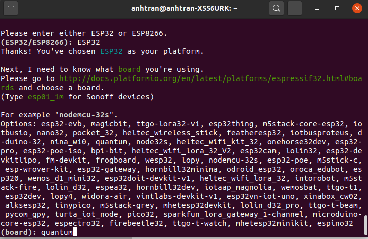

# HƯỚNG DẪN THÊM THIẾT BỊ ESPHOME VÀO HOME ASSISTANT

## I. ESPHome là gì

* ESPHome là hệ thống điều khiển ESP8266 / ESP32, ESPHome nó sẽ giúp chúng ta đơn giản hơn trong việc cấu hình và thêm thiết bị, để có sở hữu thiết bị thông minh trong chính ngôi nhà của mình thì ta chỉ cần cấu hình các thông tin cần thiết vào API ESPHome cung cấp, hệ thống ESPHome sẽ tự động nạp code vào chip giúp chúng ta, như vậy thì chúng ta đã có thể sở hữu một thiết bị thông minh trong chính ngôi nhà của mình.

## II. Một số thiết bị trong ESPHome

* Sensor Components


* Binary Sensor Components


* Output Components


* Light Components


* Switch Components


* Fan Components


* Display Components


* Misc Components


* Cookbook


Xem chi tiết thông tin thiết bị: https://esphome.io/#

## III. Hướng dẫn thêm thiết bị ESPHome vào Home Assistant

### 1. Cài đặt ESPHome

Cài đặt Python và cài đặt tập lệnh bảng điều khiển thông qua pip3.

```python
pip3 install esphome
```
### 2. Khởi tạo project 

#### Bước 1 : Tạo file chứa project


#### Bước 2 : Điền thông tin dòng vi điều khiển đang sử dụng 


#### Bước 3 : Chọn dòng board ( đọc ở trên mặt chip và tìm kiếm ở google )



#### Bước 4 : Thiết lập Wifi


#### Bước 5 : Thiết lập password để nạp code bằng OTA 


### 3. Khởi động và chạy project 

#### Bước 1 : Config project và chạy project 


#### Bước 2 : Chọn phương thức code xuống board ( chọn 1 )


#### Bước 3 : Copy địa chỉ IP, dùng để config với HASS


### 4. Thêm thiết bị vào Home Assitant

#### Bước 1 : Chọn configuration


#### Bước 2 : Ấn vào dấu cộng phía tay phải bên dưới màn hình


#### Bước 3 : Nhập địa chỉ IP đã copy ở phần 3 bước 3


#### Bước 4 : Submit yêu cầu ở bước 3, chúng ta sẽ có được ESPHome như trong hình


#### Bước 5 : Thêm thiết bị vào phòng 


